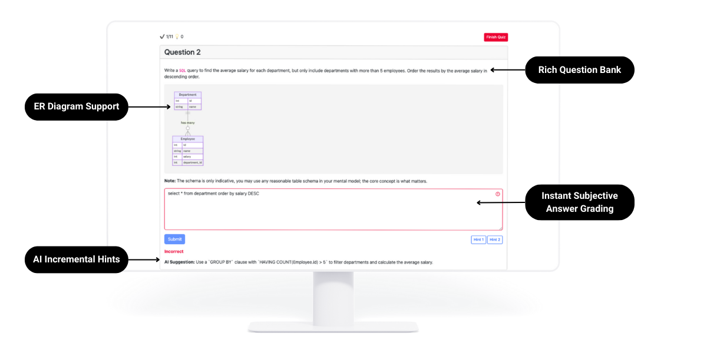

# A quiz app boilerplate

This is a simple quiz app boilerplate

## Features

- Load questions from a JSON file
- Display questions and answers
    - Supports diagrams via mermaid
    - Supports markdown text
- Provide hints for incorrect answers
- Save user answers to a JSON file
- Evaluate subjective questions using AI
- Incremental hints using AI

## Installation

1. Clone the repository
2. Run `npm install`
3. Run `npm run dev` to start the development server

## Deployment

1. Set the environment variables (check out `sample.env` for the list of these vars)
2. Run `npm run build` to build the app
4. The `dist` folder will be created with the app ready to be deployed
4. Deploy the `dist` folder to your favorite hosting service