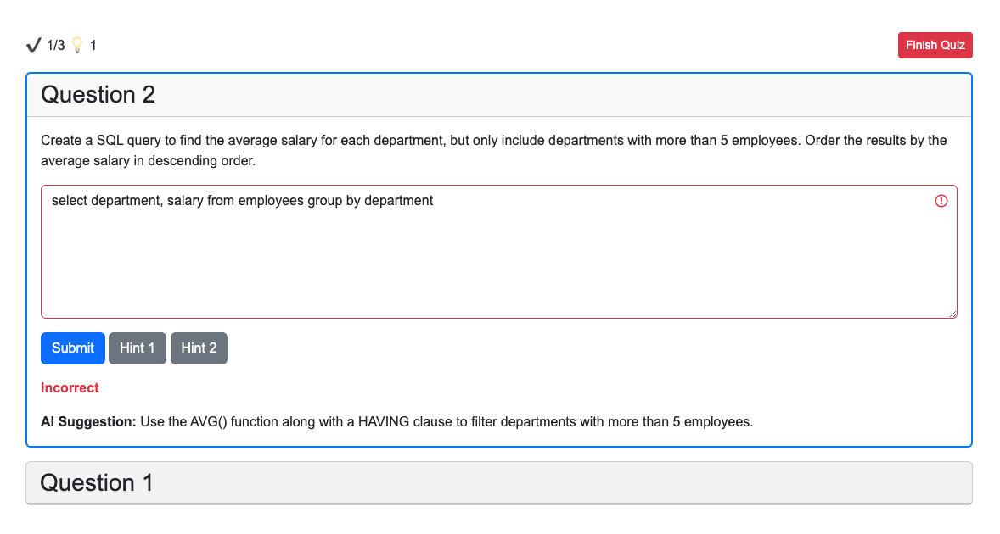

# A quiz app boilerplate

This is a simple quiz app boilerplate

## Features

- Load questions from a JSON file
- Display questions and answers
- Provide hints for incorrect answers
- Save user answers to a JSON file

## Installation

1. Clone the repository
2. Run `npm install`
3. Run `npm run dev` to start the development server

## Deployment

1. Run `npm run build` to build the app
2. The `build` folder will be created with the app ready to be deployed
3. Deploy the `build` folder to your favorite hosting service
