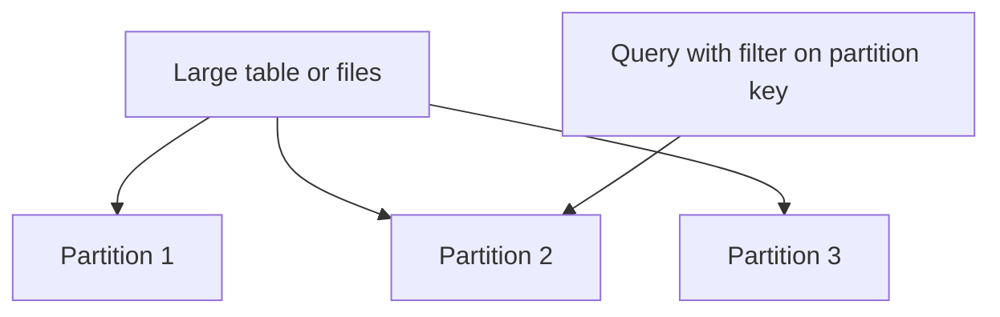

Explain the concept of data partitioning in big data systems and provide an example of how it can improve query performance.

## Expected answer

Data partitioning is the process of dividing large datasets into smaller, more manageable pieces called partitions. This technique can significantly improve query performance by allowing parallel processing and reducing the amount of data scanned. For example, in a large table of sales data, partitioning by date can allow queries for specific time periods to scan only relevant partitions, rather than the entire dataset.

## Hints

- Consider how breaking up data can affect query execution.
- Think about scenarios where you'd want to access only a portion of a large dataset.
