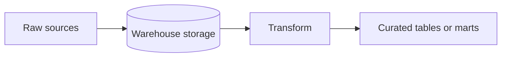

In a common cloud data-warehouse pattern, **raw** data is loaded into the warehouse first, and **transformations** run inside the warehouse (often with SQL). This pattern is most often called:

## Options

A. ELT
B. ETL
C. OLTP
D. CDC

## Expected answer

A. ELT

## Hints

- One acronym places **load** before **transform**; the other does the opposite.
- Loading first, then transforming in the warehouse, matches the ordering of letters in the answer.
