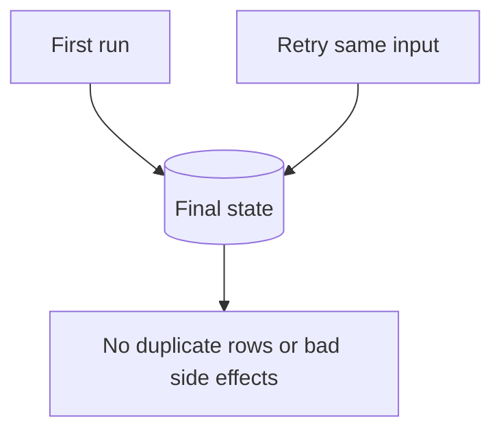

In data engineering, what does it mean for a pipeline step or job to be **idempotent**, and why does that matter when jobs can be retried or run more than once?

## Expected answer

An idempotent step produces the same final system state when executed once or multiple times—retries do not create duplicate rows, double charges, or inconsistent side effects. That matters because orchestrators and failure recovery often rerun tasks; idempotency makes those reruns safe.

## Hints

- Think about what should happen if the same batch is processed twice by mistake.
- Relate the idea to "same end state" rather than "identical work every time."
