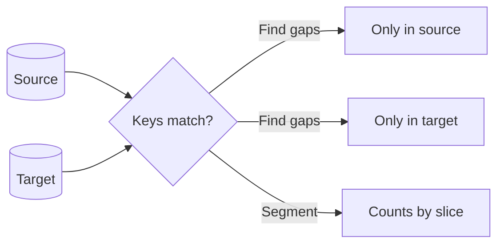

After loading data from a source system into a target table, `SELECT COUNT(*)` on the source and target **do not match**. What is a **practical first diagnostic step** before re-running a full reload?

## Options

A. Truncate the target and reload all history
B. Compare keys: find rows present in only one side (e.g. anti-join or `EXCEPT`) or compare counts by segment
C. Drop indexes on the target to speed up the next load
D. Assume the source count is wrong and skip validation

## Expected answer

B. Compare keys: find rows present in only one side (e.g. anti-join or `EXCEPT`) or compare counts by segment

## Hints

- You want to **localize** where the mismatch comes from before heavy fixes.
- Full reloads hide whether the issue is incremental logic, duplicates, or filters.
