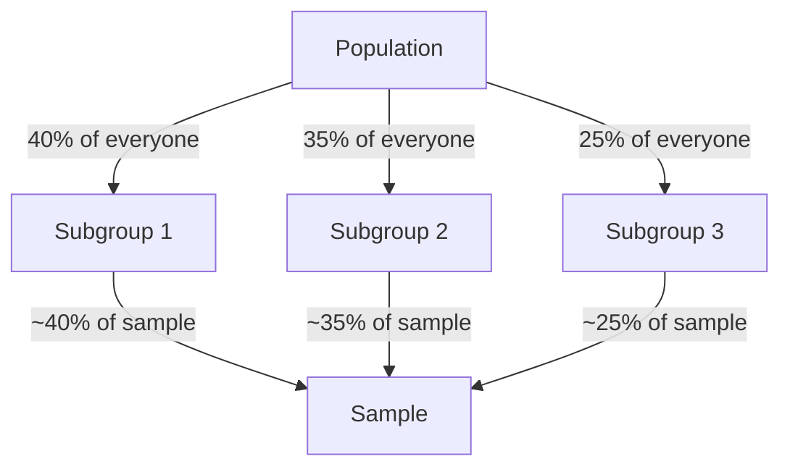

Which sampling method is most appropriate when you need to ensure that different subgroups of a population are represented proportionally in your sample?

_Example shares only — the idea is that the **mix in the sample** matches the **mix in the population**._

## Options

A. Simple random sampling
B. Stratified sampling
C. Cluster sampling
D. Convenience sampling

## Expected answer

B. Stratified sampling

## Hints

- This method divides the population into subgroups before sampling.
- It ensures representation of all subgroups in the final sample.
