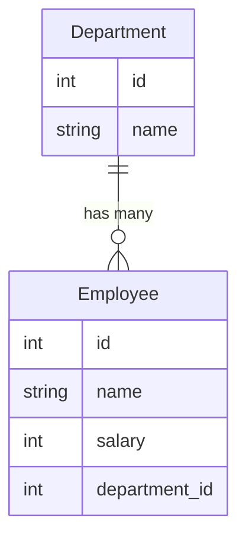

Write a `SQL` query to find the average salary for each department, but only include departments with more than 5 employees. Order the results by the average salary in descending order.

**Note:** The schema is only indicative, you may use any reasonable table schema in your mental model; the core concept is what matters.

## Expected answer

select department, AVG(salary) as salary_avg from employees group by department having count(*) > 5 order by salary_avg desc

## Hints

- Use GROUP BY to group by department.
- HAVING is used to filter grouped results.
