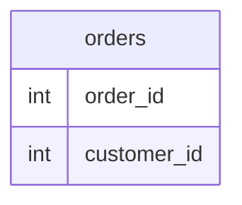

Table `orders` has at least columns `order_id` and `customer_id`. Write a SQL query that lists every `order_id` value that appears **more than once** in the table, and how many times each appears.

## Expected answer

SELECT order_id, COUNT(*) AS cnt FROM orders GROUP BY order_id HAVING COUNT(*) > 1;

## Hints

- Aggregate per `order_id`, then filter aggregates with `HAVING`, not `WHERE` on the raw rows.
- `COUNT(*)` counts rows per group after `GROUP BY order_id`.
