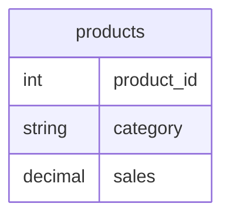

The following SQL query is intended to retrieve the total sales for each product category, but it contains an error. Identify and fix the error: `SELECT category, SUM(sales) FROM products GROUP BY product_id;`

## Expected answer

SELECT category, SUM(sales) FROM products GROUP BY category;

## Hints

- Ensure that the GROUP BY clause includes the correct column.
- Think about how to aggregate data by category.
