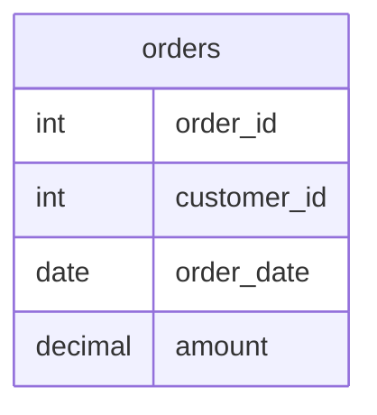

Table `orders` has columns `order_id`, `customer_id`, `order_date`, and `amount`. Write a SQL query that returns **one row per `customer_id`**: the row with the **latest** `order_date`. If two rows share the same latest date for a customer, pick the one with the **larger** `order_id`.

## Expected answer

SELECT * FROM (SELECT *, ROW_NUMBER() OVER (PARTITION BY customer_id ORDER BY order_date DESC, order_id DESC) AS rn FROM orders) t WHERE rn = 1;

## Hints

- Use a window function ranked per `customer_id`, then keep rank 1.
- Order by `order_date` descending, then break ties with `order_id` descending.
