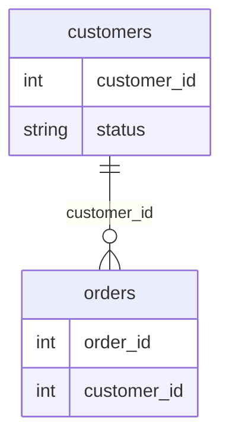

Optimize the following SQL query to improve its performance: `SELECT * FROM orders WHERE customer_id IN (SELECT customer_id FROM customers WHERE status = 'active');`

## Expected answer

SELECT o.* FROM orders o JOIN customers c ON o.customer_id = c.customer_id WHERE c.status = 'active';

## Hints

- Consider using a JOIN instead of a subquery.
- Think about how to reduce the number of rows processed.
